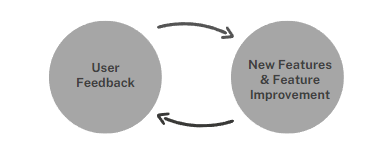

# AutoWijzer

Autowijzer; De snelste route naar uw nieuwe auto.

[Visit](https://autowijzer.streamlit.app/)

_Huidige stage: project_

## Functionality

**Find the perfect car in 2 minutes.** This streamlit project is a tool that can help anyone find the perfect car for them to buy. The user is prompted with a series of questions that anyone could answer regardless of car knowledge. Then, the perfect car is presented to them, including useful statistics and links to where they can buy the car.

## How did this idea come to life?

Many large websites offer similar tools existed for finding a car, but none offered the functionality for the Dutch market. Together with Wouter Smits, Joep Nelissen and Jesse Kamerbeek, we have developed the details on how this idea should come to life.

## Which frameworks and technologies are used?

The main functionality behind this tool is powered by AI through the use of simple LLM's.

Dashboard is written in streamlit, python. Backend is written using python only.

## Coming features

Below is a list of features that are to be implemented. This list is updated regularly.

- Links to actual car sites
- Updated results page including simple-to-read statistics on the car
- Results for best car(s) summarized in a document

### (boring!) backend features

- Pydantic integration

## Contact

Tips voor features? Please e-mail davidmoerdijk@gmail.com

